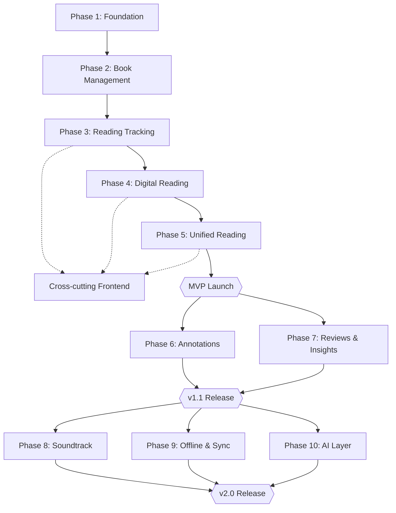

# Bunko — Phase-Wise Implementation Plan

This is the bridge between the strategic roadmap (`SRS.md` §36) and the
tactical backlog (`TASKS.md`). Phases 1-5 already have concrete,
agent-ready tickets. Phases 6-10 are scoped here at a planning level
only — per `AGENTS.md` §3, their tickets are deliberately not written
until each phase actually begins, so this plan describes *what* and
*roughly how much*, not yet *ticket-by-ticket how*.

## 1. How to Read This Document

- **Phases 1-5 (MVP):** fully ticketed. This doc summarizes; `TASKS.md`
  is the source of truth for execution.
- **Phases 6-10 (Post-MVP):** scoped at the feature/deliverable level,
  with a rough relative size estimate. When a phase's turn comes,
  break it into tickets following the same format as `TASKS.md`
  (ID, depends-on, SRS refs, acceptance criteria) before an agent
  starts it.
- Sizes are **relative ticket-count estimates for planning**, not
  calendar time — this project has no fixed team size or velocity
  data yet, so a date-based estimate would be fabricated. Once Phase
  1-5 tickets are actually executed, you'll have real velocity data to
  turn these into calendar estimates.

## 2. Phase Overview

| Phase | Tier | Tickets | Status |
|---|---|---|---|
| 1. Foundation | MVP | 13 (T-001–T-011 + T-001a/b) | Ready — `TASKS.md` |
| 2. Book Management | MVP | 7 (T-012–T-017 + T-013a) | Ready — `TASKS.md` |
| 3. Reading Tracking | MVP | 6 (T-018–T-023) | Ready — `TASKS.md` |
| 4. Digital Reading | MVP | 8 (T-024–T-031) | Ready — `TASKS.md` |
| 5. Unified Physical/Digital Reading | MVP | 6 (T-032–T-037) | Ready — `TASKS.md` |
| *(cross-cutting)* Frontend | MVP | 4 (T-038–T-041) | Ready — `TASKS.md` |
| 6. Annotations | Fast-Follow v1.1 | ~9 (est.) | Scoped below, not ticketed |
| 7. Reviews & Reading Insights | Fast-Follow v1.1 | ~8 (est.) | Scoped below, not ticketed |
| 8. Soundtrack | Future v2+ | ~7 (est.) | Scoped below, not ticketed |
| 9. Offline & Sync | Future v2+ | ~12 (est.) | Scoped below, not ticketed |
| 10. AI Layer | Future v2+ | ~10 (est.) | Scoped below, not ticketed |

**MVP total: 44 tickets, all written and ready.**
**Post-MVP total: ~46 tickets, estimated — to be written per-phase.**

## 3. Dependency & Sequencing Diagram

Solid arrows are hard technical dependencies (must finish before the
next starts). Dotted arrows mean "can run alongside." Phases 6 and 7
have no dependency on each other and can be built in parallel if you
have the capacity; same for 8, 9, and 10 after v1.1. If you're running
one agent at a time, treat this diagram as a strict top-to-bottom
queue instead — go phase by phase in the order above.

## 4. Phase 1-5 Summary (MVP — see `TASKS.md` for execution)

| Phase | Objective | Core Risk (SRS §38) |
|---|---|---|
| 1. Foundation | Auth, DB, CI, base server running | — |
| 2. Book Management | Library CRUD: works, editions, copies, shelves | — |
| 3. Reading Tracking | Reading journeys, session lifecycle, journal, basic stats | — |
| 4. Digital Reading | EPUB/PDF import, in-app reader, auto progress | §38.2 PDF variability, §38.3 EPUB complexity |
| 5. Unified Reading | Cross-edition position mapping — **the core differentiator** | §38.1 Edition mapping accuracy |

Don't start Phase 2 before Phase 1's auth/DB/CI foundation is merged —
every later phase assumes an authenticated user and a working
database. Don't start Phase 5 before Phase 4's EPUB/PDF indexing
exists — the mapping algorithm has nothing to map without it.

## 5. Phase 6 — Annotations (Fast-Follow v1.1, ~9 tickets est.)

**Objective:** turn passing session notes (MVP's basic free-text field)
into the full annotation system the product vision promises —
highlights, quotes, and standalone notes anchored to a precise
location.

**Key deliverables (SRS §13, §36.2):**
- `Highlight`, `Quote`, standalone `Note` schema (deferred from
  `DATA_MODEL.md` §4 — build now)
- Location anchoring reuses the text-anchor/structural-ID machinery
  already built in Phase 5 (`continuity` module) — don't reinvent it
- Annotation search (likely Postgres full-text search; defer
  pgvector/semantic search to Phase 10)
- Journal integration: annotations appear inline in journal entries
- Frontend: highlight-and-annotate UI in the digital reader, and a
  simple "add note" flow for physical sessions

**Depends on:** Phase 4 (reader must exist) and Phase 5 (location
anchoring must exist). Does not depend on Phase 6/7 order relative to
each other.

## 6. Phase 7 — Reviews & Reading Insights (Fast-Follow v1.1, ~8 tickets est.)

**Objective:** let users rate/review finished books and see real
patterns in their reading history — this is the first phase that
benefits from actual MVP usage data existing.

**Key deliverables (SRS §14, §19, §36.2):**
- `Review`, `Rating` schema and CRUD endpoints
- Reading analytics beyond the MVP's basic stats (T-023): trends over
  time, reading pace, streak logic hardened for edge cases (timezone
  changes, gaps)
- Frontend stats dashboard (likely a dedicated `chart`/visualization
  view)

**Depends on:** Phase 3 (session/journal data must exist to have
anything to analyze). Best started after MVP has real usage, not
immediately at v1.1 kickoff, even though nothing technically blocks
starting it earlier.

## 7. Phase 8 — Soundtrack (Future v2+, ~7 tickets est.)

**Objective:** contextual music tied to genre/mood/playlists during
reading — a differentiator, but non-core.

**Key deliverables (SRS §17, §36.2):**
- `Soundtrack`, `SoundtrackMapping` schema
- Genre/mood → playlist mapping logic
- Third-party music provider integration (Spotify/Apple Music API) —
  **flag early**: SRS §38.4 notes providers may restrict background
  playback or API access. Prototype the provider integration in a
  spike ticket *before* committing to the full ticket breakdown, since
  this risk could reshape the phase's scope.
- Playback controls in the reader UI, independent of reading progress

**Depends on:** nothing technical from Phases 6/7/9/10 — can be
sequenced independently once v1.1 ships.

## 8. Phase 9 — Offline & Sync (Future v2+, ~12 tickets est., highest complexity of the post-MVP phases)

**Objective:** offline digital reading and multi-device sync — the
phase MVP deliberately deferred (`SRS.md` §36.4) because of its
engineering cost.

**Key deliverables (SRS §21, §36.2):**
- `DeviceSession`, `SyncEvent` schema
- Offline download + local caching strategy for digital files (service
  worker or equivalent for the web client)
- Offline annotation/session queuing, synced on reconnect
- **Conflict resolution strategy** — this is the hard part. Decide the
  strategy (last-write-wins vs. field-level merge vs.
  user-prompted-resolution) as its own design ticket *before* breaking
  the rest of this phase into tickets; the rest of the phase's tickets
  depend on that decision.

**Depends on:** Phase 3 (sessions) and Phase 5 (continuity/position
data, which sync must not corrupt). Recommend doing this phase *after*
Phase 6 (Annotations) even though nothing strictly blocks it, since
Phase 9 must also sync annotations if Phase 6 already shipped.

## 9. Phase 10 — AI Layer (Future v2+, ~10 tickets est.)

**Objective:** the foundation-only promise from SRS §1.2 — AI
understanding of the user's reading history, notes, and preferences.

**Key deliverables (SRS §20, §36.2, `ARCHITECTURE.md` §8):**
- Scaffold `ai-service/` (Python 3.12 + FastAPI) as a new, separate
  service — this is the one phase that isn't just new modules inside
  `backend/`
- Enable `pgvector` usage (already available on the Postgres image
  since MVP, per `DATA_MODEL.md` §5) and build the embedding pipeline
  over notes/quotes/highlights (depends on Phase 6 existing)
- Semantic search across notes/quotes
- Personal reading summaries and pattern analysis
- Personal recommendations and AI-generated insights
- **Privacy controls are not optional polish here** — SRS §38.5 flags
  this explicitly. Build explicit consent controls and data-processing
  policy disclosure as part of this phase, not as a follow-up.

**Depends on:** Phase 6 (Annotations) — there's no meaningful corpus
of notes/quotes to reason over without it. Also benefits from Phase 7
existing (reading patterns are more interesting with review/rating
data available).

## 10. Milestones

| Milestone | Reached After | What Ships |
|---|---|---|
| **MVP Launch** | Phase 5 | Personal library, digital reader, and the core differentiator: one reading journey across physical and digital formats |
| **v1.1** | Phases 6-7 | Full annotation system, reviews, and real reading insights |
| **v2.0** | Phases 8-10 | Soundtrack, offline/multi-device sync, AI-powered personal reading intelligence |

## 11. When You're Ready to Start a Post-MVP Phase

1. Re-read the relevant SRS section(s) referenced above in full.
2. Write that phase's tickets in `TASKS.md`, following the exact
   format already used for Phases 1-5 (ID, Depends on, SRS refs,
   description, checkbox acceptance criteria).
3. Update `DATA_MODEL.md` to move that phase's entities out of §4
   ("Deferred") into the live schema.
4. Update `ARCHITECTURE.md` if the phase introduces a new service
   boundary (only Phase 10 does, per §9 above).
5. Only then hand tickets to an agent — don't skip straight from this
   planning doc to implementation.
